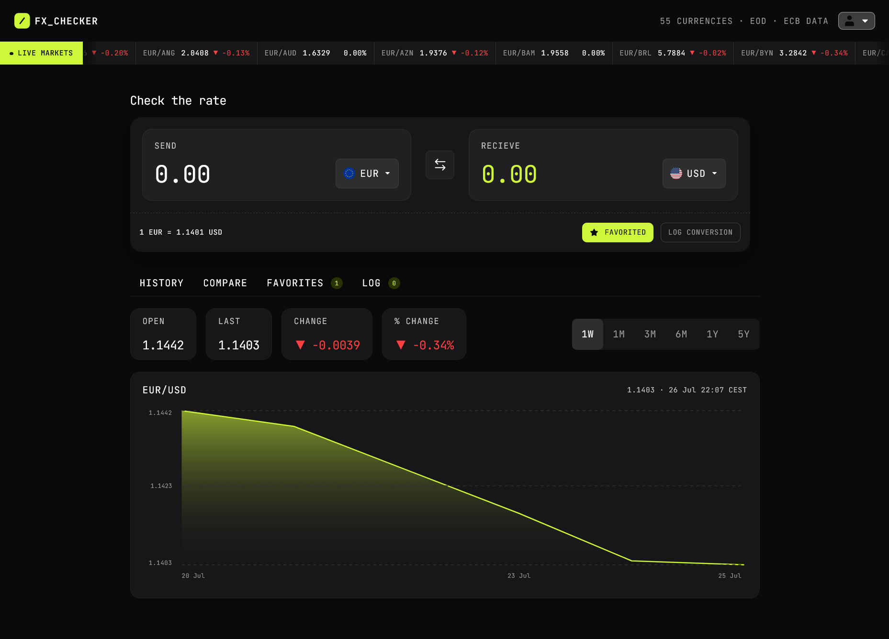
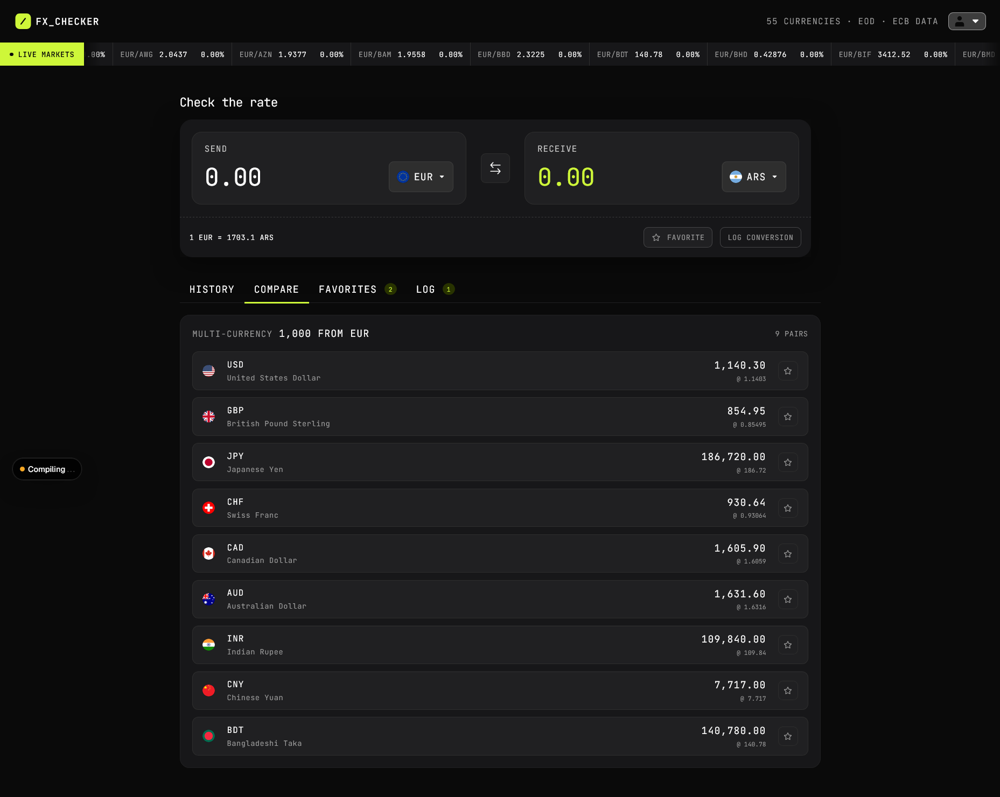
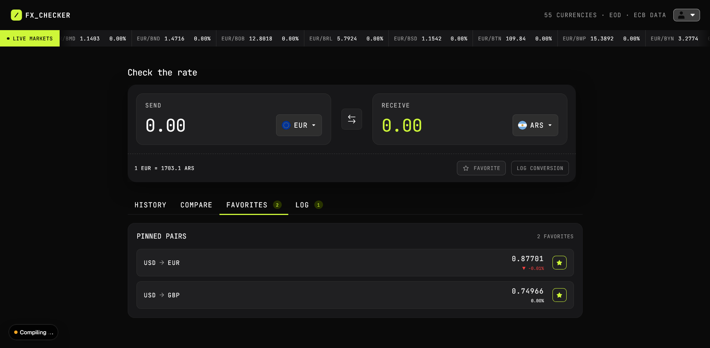
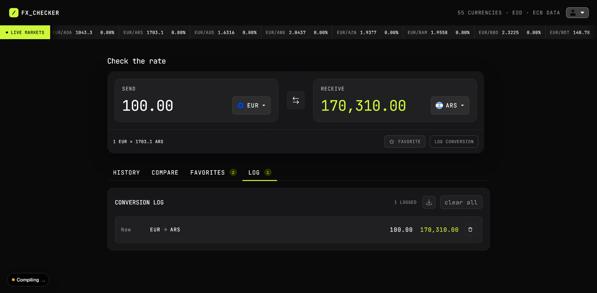

# Frontend Mentor - FX Checker solution

This is a solution to the [FX Checker challenge on Frontend Mentor](https://www.frontendmentor.io/challenges/foreign-exchange-currency-converter). Frontend Mentor challenges help you improve your coding skills by building realistic projects. 

## Table of contents

- [Overview](#overview)
  - [The challenge](#the-challenge)
  - [Screenshot](#screenshot)
  - [Links](#links)
- [My process](#my-process)
  - [Built with](#built-with)
  - [What I learned](#what-i-learned)
  - [Continued development](#continued-development)
  - [Useful resources](#useful-resources)
  - [AI Collaboration](#ai-collaboration)
- [Author](#author)
- [Acknowledgments](#acknowledgments)

## Overview

### The challenge

Your users should be able to:

#### Converter

- Enter an amount to send and see it convert in real time as they type
- Pick the "send" and "receive" currencies from a searchable currency picker
- See the live exchange rate for the active pair (for example, `1 USD = 0.8530 EUR`)
- Swap the send and receive currencies with the swap button
- Favorite the active pair, and log a conversion to their history

#### Currency picker

- Search the full list of available currencies by code or name
- See currencies grouped into "Popular" and "Other currencies", each row showing the flag, code, and name
- See a check against the currency that's currently selected

#### Live markets ticker

- See a ticker of currency pairs, each with its current rate and 24-hour change (up or down)

#### Rate history

- View a line and area chart of the active pair's rate over time
- Switch the chart range between 1D, 1W, 1M, 3M, 1Y, and 5Y
- See the open, last, absolute change, and percentage change for the selected range

#### Compare

- See their send amount converted into a range of other currencies at once, each with its reference rate
- Pin or unpin any comparison row to their favorites

#### Favorites

- See their pinned pairs, each with its live rate and 24-hour change
- Load a pinned pair back into the converter by selecting its row
- Unpin a pair they no longer want to track

#### Conversion log

- See a log of conversions they've made, each showing the relative time, the pair, and the send and receive amounts
- Clear the whole log
- Delete an individual entry

#### UI & accessibility

- View the optimal layout for the interface depending on their device's screen size
- See hover and focus states for all interactive elements on the page
- Navigate the entire app using only their keyboard

#### What I added

- Favorites and Logs are stored in a database
- Authentication: Create an account or continue as guest
- Guests can link their session to a Google account to become permanent users
- Export log to .csv

### Screenshot






### Links

- Live Site URL: [https://fx-checker.gruppe-l.me](https://fx-checker.gruppe-l.me/)

## My process

### Built with

- Semantic HTML5 markup
- CSS custom properties
- Flexbox
- CSS Grid
- Mobile-first workflow
- [React](https://reactjs.org/) - JS library
- [Next.js](https://nextjs.org/) - React framework
- [Tailwind CSS](https://tailwindcss.com/) - For styles
- [Supabase](https://supabase.com/) - For backend

### What I learned

This was the first major project with NextJS App Router that I built myself from scratch. I learned how to implement server- and client-side routing, as well as how proxy works. In addition I learned a couple new Tailwind classes and how to use Supabase with SSR. In this project I also implemented an Authentication flow, including OAuth 2.0 with Supabase. I learned how to do this properly with SSR. On top of that I leveled up my SQL skills by writing triggers and functions for my database and applying RLS to my tables (with a little bit of AI assistance).

I am especially proud of my auth/callback route. Here is a code snippet from it:

```js
export async function GET(request: Request) {
  const url = new URL(request.url)
  const code = url.searchParams.get('code')
  const next = url.searchParams.get('next')
  const safeNext = isSafeNext(next)
  // Vercel preview deployment fix
  const forwardedHost = request.headers.get('x-forwarded-host')
  const isLocal = process.env.NODE_ENV === 'development'
 
  if (code) {
    const supabase = await createClient()
    const { error } = await supabase.auth.exchangeCodeForSession(code)
 
    if (!error) {
      if (isLocal) {
        return NextResponse.redirect(`${url.origin}${safeNext}`)
      } else if (forwardedHost) {
        return NextResponse.redirect(`https://${forwardedHost}${safeNext}`)
      } else {
        return NextResponse.redirect(`${url.origin}${safeNext}`)
      }
    }
  }
 
  return NextResponse.redirect(`${url.origin}/auth/error`)
}
```

### Continued development

In the future I want to improve the accessibility of my projects. Especially since this project includes line charts and I feel like this area is lacking a bit. Also I want to write tests for my components and tidy up the project structure and add some more comments to my code.

### Useful resources

- [Supabase Docs](https://supabase.com/docs) - This helped me setting supabase up and helped later with choosing the right helper functions.
- [NextJS Docs](https://nextjs.org/docs/app/api-reference/file-conventions/proxy) - This article helped me understand the purpose of proxys more and I feel like I started to grasp how they work after reading this.

### AI Collaboration

For this project I didn't use too many AI tools. I used it help me with writing databse functions and triggers as well as helping me with the proxy. I used Claude Sonnet 5. The vast majority of my code I wrote myself. Also I found searching the web for the right article was sometimes more helpful than asking AI.

## Author

-  [Github](https://github.com/jan-lindner00)

## Acknowledgments

This challenge was part of a hackathon hosted by Frontend Mentor. I want to thank the participants of the competition as their solutions inspired me to add Auth and a Database to my project, as it was storing data in Local Storage in the beginning.
